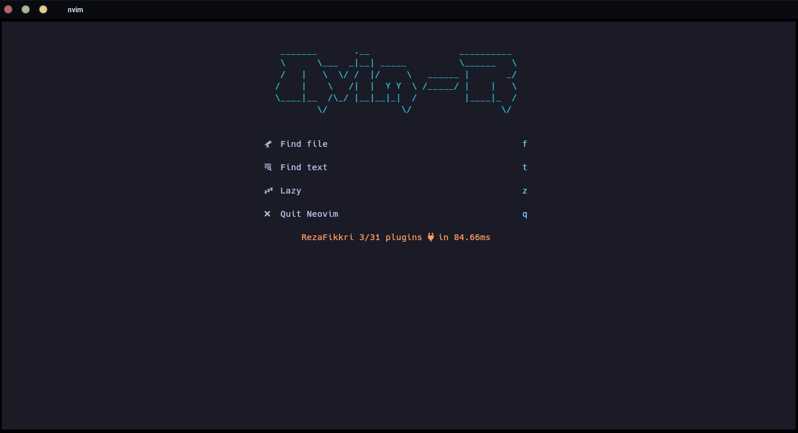
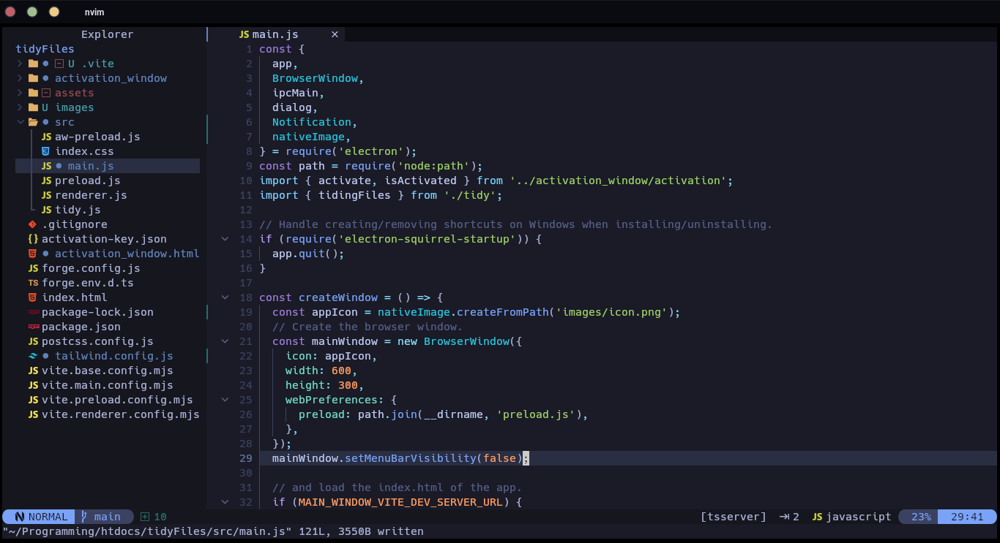

<h1 align="center">Nvim R</h1>

<div align="center" style="margin-bottom: 10px">
  
  
  <a href="https://github.com/rezafikkri/nvim-r">
    
  </a>
</div>

### Demo



## Requirements
1. Neovim >= [v0.10.0](https://github.com/neovim/neovim/releases/latest)
2. [Nerd font](https://www.nerdfonts.com/)
3. C compiler for `nvim-treesitter`. See [here](https://github.com/nvim-treesitter/nvim-treesitter#requirements)

## Install
- Remove old config or make backup
```bash
# remove old
rm -rf ~/.config/nvim
rm -rf ~/.local/share/nvim

# make backup
mv ~/.config/nvim ~/.config/nvim.bak
mv ~/.local/share/nvim ~/.local/share/nvim.bak
```
- Clone nvim-r
```bash
git clone https://github.com/rezafikkri/nvim-r.git ~/.config/nvim
```
- Remove `.git` folder
```bash
rm -rf ~/.config/nvim/.git
```
- Start neovim
```bash
nvim
```

### Uninstall
```bash
rm -rf ~/.config/nvim
rm -rf ~/.local/share/nvim
```

## Configuration
This is simple, you can directly edit config that you have clone. If you have a question or problem, you can create issue, but before it, make sure you have search related issue.

## Keymaps
Info:
- `<leader>` is space
- `<C>` is Ctrl, so if `<C-a>` then `Ctrl+a`
- `<S>` is Shift, so if `<S-a>` then `Shift+a`
- `<A>` is Alt, so if `<A-a>` then `Alt+a`
- To show general keymaps, press `<leader>` (show up after 300ms)

### Window
| Key | Description | Mode |
| --- | --- | --- |
| `<C-h>` | Move the cursor to left window | Normal |
| `<C-j>` | Move the cursor to bottom window | Normal |
| `<C-k>` | Move the cursor to top window | Normal |
| `<C-l>` | Move the cursor to right window | Normal |
| `<C-Up>` | Decrease window size (horizontal) | Normal |
| `<C-Down>` | Increase window size (horizontal) | Normal |
| `<C-Left>` | Descrease window size (vertical) | Normal |
| `<C-Right>` | Increase window size (vertical) | Normal |

### Terminal
| Key | Description | Mode |
| --- | --- | --- |
| `<C-\>` | Toggle (last) float terminal | Normal, Terminal |

Tip:
- Open multiple terminal: `[num] <C-\>` (in normal mode), ex. `1 <C-\>` for open first terminal, `2 <C-\>` for open second terminal, etc.
- If you has open second terminal and want to back first terminal, simple, press `1 <C-\>` again (in normal mode).

### Editing
| Key | Description | Mode |
| --- | --- | --- |
| `<A-j>` | Move text to down | Normal, Visual |
| `<A-k>` | Move text to up | Normal, Visual |
| `<Tab>` | Increase indentation repeatedly | Visual |
| `<S-Tab>` | Decrease indentation repeatedly | Visual |
| `<leader>h` | Clear highlight (ex. highlight after search) | Normal |
| `<leader>t` | Comment line | Normal |

### Exproler
| Key | Description | Mode |
| --- | --- | --- |
| `<leader>e` | Toggle side file explorer | Normal |
| `<leader>a` | Add new file | In file explorer window |
| `<leader>d` | Trash file | In file explorer window |
| `<leader>D` | Delete file | In file explorer window |

Info:
- To see more keymaps for explorer, press `g?`, to back explorer again, press `q`
- Different of *trash* dan *delete* in above keymaps: *trash* is move file or folder to trash (so, file or older can be restore), while *delete* is delete file or folder permanently

### Lazygit
| Key | Description | Mode |
| --- | --- | --- |
| `<leader>g` | Open lazygit | Normal |
| `q` | Close lazygit | In lazygit window |

Info:
- For more keymaps in lazygit, see [here](https://github.com/jesseduffield/lazygit/blob/master/docs/keybindings)
- ex. For close lazygit: if you have press `a` then `c` for commit, and want to cancel, you can press `<Esc>` first and than press `q` for close lazygit

### Buffers
| Key | Description | Mode |
| --- | --- | --- |
| `<leader>c` | Close current buffer | Normal |
| `\]` | Navigate to next buffer | Normal |
| `\[` | Navigate to prev buffer | Normal |
| `<leader>ba` | Close all buffers | Normal |
| `<leader>bn` | Move current buffer to next | Normal |
| `<leader>bp` | Move current buffer to prev | Normal |

### Teloscope
| Key | Description | Mode |
| --- | --- | --- |
| `<leader>ff` | Find files | Normal |
| `<leader>fg` | Live grap (search for a string in your current working directory and get results live as you type.) | Normal |

Info:
- For close telescope, press `<C-c>` or press `<Esc>` 2x
- For more about telescope, see [here](https://github.com/nvim-telescope/telescope.nvim)

### LSP
| Key | Description | Mode |
| --- | --- | --- |
| `<leader>ld` | Document diagnostics (show diagnostics for the current buffer) | Normal |
| `<leader>lw` | Workspace diagnostics (show diagnostics for the current workspace) | Normal |
| `<leader>li` | Info (list of active lsp for the current buffer) | Normal |
| `<leader>lI` | Installer info (open [Mason](https://github.com/williamboman/mason.nvim)) | Normal |
| `<leader>lj` | Next diagnostic (in current buffer) | Normal |
| `<leader>lk` | Prev diagnostic (in current buffer) | Normal |
| `<leader>lt` | Toggle diagnostic (show and hide diagnostic, but in lualine still to show) | Normal |

### Plugins
| Key | Description | Mode |
| --- | --- | --- |
| `<leader>zh` | List plugins | Normal |
| `<leader>zi` | Install plugins | Normal |
| `<leader>zd` | Show debug informations | Normal |
| `<leader>zl` | Show recent updates | Normal |
| `<leader>zp` | Show detailed profiling | Normal |
| `<leader>zs` | Run install, clean and update | Normal |
| `<leader>zu` | Update plugins | Normal |
| `<leader>zx` | Clean plugins that are no longer needed | Normal |

Info:
- This config using [folke/lazy.nvim](https://github.com/folke/lazy.nvim) plugin manager.

### Which key
| Key | Description | Mode |
| --- | --- | --- |
| `<C-d>` | Scroll down popup | Inside popup |
| `<C-u>` | Scroll up popup | Inside popup |

## List Plugins
List plugins used in this config

| Name  | Description |
| ------------- | ------------- |
| [folke/lazy.nvim](https://github.com/folke/lazy.nvim) | A modern plugin manager for Neovim |
| [goolord/alpha-nvim](https://github.com/goolord/alpha-nvim) | A lua powered greeter like vim-startify / dashboard-nvim |
| [windwp/nvim-autopairs](https://github.com/windwp/nvim-autopairs) | autopairs for neovim written in lua |
| [akinsho/bufferline.nvim](https://github.com/akinsho/bufferline.nvim) | A snazzy bufferline for Neovim |
| [hrsh7th/nvim-cmp](https://github.com/hrsh7th/nvim-cmp) | A completion plugin for neovim coded in Lua |
| [hrsh7th/cmp-buffer](https://github.com/hrsh7th/cmp-buffer) | nvim-cmp source for buffer words |
| [hrsh7th/cmp-path](https://github.com/hrsh7th/cmp-path) | nvim-cmp source for path |
| [saadparwaiz1/cmp_luasnip](https://github.com/saadparwaiz1/cmp_luasnip) | luasnip completion source for nvim-cmp |
| [hrsh7th/cmp-nvim-lsp](https://github.com/hrsh7th/cmp-nvim-lsp) | nvim-cmp source for neovim builtin LSP client |
| [L3MON4D3/LuaSnip](https://github.com/L3MON4D3/LuaSnip) | Snippet Engine for Neovim written in Lua |
| [rafamadriz/friendly-snippets](https://github.com/rafamadriz/friendly-snippets) | Set of preconfigured snippets for different languages |
| [folke/tokyonight.nvim](https://github.com/folke/tokyonight.nvim) | A clean, dark Neovim theme |
| [numToStr/Comment.nvim](https://github.com/numToStr/Comment.nvim) | Smart and powerful comment plugin |
| [JoosepAlviste/nvim-ts-context-commentstring](https://github.com/JoosepAlviste/nvim-ts-context-commentstring) | Neovim treesitter plugin for setting the commentstring based on the cursor location in a file |
| [lewis6991/gitsigns.nvim](https://github.com/lewis6991/gitsigns.nvim) | Git integration for buffers |
| [lukas-reineke/indent-blankline.nvim](https://github.com/lukas-reineke/indent-blankline.nvim) | Indent guides for Neovim |
| [neovim/nvim-lspconfig](https://github.com/neovim/nvim-lspconfig) | Quickstart configs for Nvim LSP |
| [williamboman/mason.nvim](https://github.com/williamboman/mason.nvim) | Easily install and manage LSP servers, DAP servers, linters, and formatters |
| [williamboman/mason-lspconfig.nvim](https://github.com/williamboman/mason-lspconfig.nvim) | Extension to mason.nvim that makes it easier to use lspconfig with mason.nvim |
| [nvim-lualine/lualine.nvim](https://github.com/nvim-lualine/lualine.nvim) | A blazing fast and easy to configure neovim statusline plugin |
| [rcarriga/nvim-notify](https://github.com/rcarriga/nvim-notify) | A fancy, configurable, notification manager for NeoVim |
| [kevinhwang91/nvim-ufo](https://github.com/kevinhwang91/nvim-ufo) | ultra fold in Neovim |
| [kevinhwang91/promise-async](https://github.com/kevinhwang91/promise-async) | Promise & Async in Lua |
| [luukvbaal/statuscol.nvim](https://github.com/luukvbaal/statuscol.nvim) | Status column plugin that provides a configurable 'statuscolumn' and click handlers |
| [nvim-tree/nvim-tree.lua](https://github.com/nvim-tree/nvim-tree.lua) | A file explorer tree for neovim written in lua |
| [nvim-telescope/telescope.nvim](https://github.com/nvim-telescope/telescope.nvim) | Find, Filter, Preview, Pick. All lua, all the time |
| [nvim-lua/plenary.nvim](https://github.com/nvim-lua/plenary.nvim) | plenary: full; complete; entire; absolute; unqualified. All the lua functions I don't want to write twice |
| [nvim-telescope/telescope-fzf-native.nvim](https://github.com/nvim-telescope/telescope-fzf-native.nvim) | FZF sorter for telescope written in c |
| [akinsho/toggleterm.nvim](https://github.com/akinsho/toggleterm.nvim) | A neovim lua plugin to help easily manage multiple terminal windows |
| [nvim-treesitter/nvim-treesitter](https://github.com/nvim-treesitter/nvim-treesitter) | Nvim Treesitter configurations and abstraction layer |
| [nvim-tree/nvim-web-devicons](https://github.com/nvim-tree/nvim-web-devicons) | lua `fork` of vim-web-devicons for neovim |
| [folke/which-key.nvim](https://github.com/folke/which-key.nvim) | Displays a popup with possible keybindings of the command you started typing |

## Thanks To
Tutorial
- https://martinlwx.github.io/en/config-neovim-from-scratch
- https://learnxinyminutes.com/docs/lua

Pre-configured Neovim
- https://github.com/pojokcodeid/nvim-lazy
- https://github.com/VonHeikemen/nvim-starter
- https://www.lazyvim.org
- https://www.lunarvim.org
- https://github.com/LunarVim/Neovim-from-scratch
